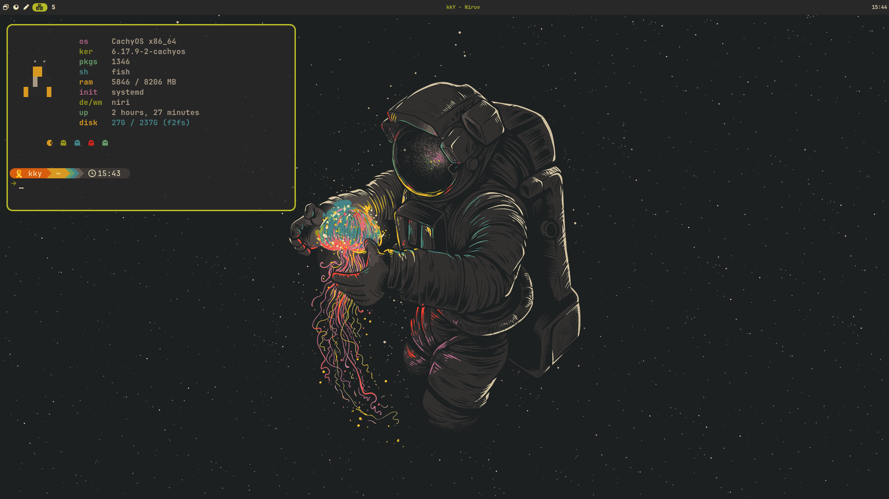

<p align="center">
  <h1 align="center">निरव · Niruv</h1>
  <p align="center">
    <em>A minimal, Gruvbox-themed desktop shell for Niri</em>
  </p>
</p>

<p align="center">
  
</p>

---

**Niruv** is a lightweight desktop shell built on [Quickshell](https://quickshell.outfoxxed.me/) (Qt/QML) for the [Niri](https://github.com/YaLTeR/niri) Wayland compositor.

The name combines **Niri** + **Gruv**box, and references the Sanskrit word **निरव** (*nirav*) — meaning "quiet" or "silent" — reflecting the shell's minimal, unobtrusive design philosophy.

## ✨ Features

- 🎨 **Gruvbox Material Dark** color scheme
- 🖥️ **Workspace indicators** with Nerd Font icons and smooth animations
- 🔋 **Battery widget** with hover effects, themed expansion, and right-click to open `battop` in a floating window
- 🕐 **Live clock** display
- ⌨️ **JetBrainsMono Nerd Font** throughout

## 📚 Documentation

For detailed guides on installation, configuration, and development, please refer to the full documentation:

- [**Introduction**](Documentation/01_Introduction.md)
- [**Installation Guide**](Documentation/02_Installation.md)
- [**Configuration**](Documentation/03_Configuration.md)
- [**Architecture & Development**](Documentation/04_Architecture_and_Development.md)
- [**Widgets & Theming**](Documentation/05_Widgets_and_Theming.md)

## 📦 Requirements

| Dependency | Description |
|------------|-------------|
| [quickshell](https://quickshell.outfoxxed.me/) | Qt/QML shell framework |
| [niri](https://github.com/YaLTeR/niri) | Scrollable-tiling Wayland compositor |
| JetBrainsMono Nerd Font | Icon and text rendering |

## 🚀 Installation

```bash
# Clone the repository
git clone https://github.com/yourusername/niruv.git

# Create symlink for Quickshell
mkdir -p ~/.config/quickshell
ln -sf /path/to/niruv ~/.config/quickshell/niruv

# Run
qs -c niruv
```

### Debug Mode

```bash
NIRUV_DEBUG=1 qs -c niruv
```

## 🎛️ Customization

### Workspace Icons

Edit `Modules/Bar/Widgets/Workspace.qml` line 77:

```qml
property var workspaceIcons: ["", "", "", "", "5", "6", "7", "8", "9", "10"]
```

Browse icons at [nerdfonts.com/cheat-sheet](https://www.nerdfonts.com/cheat-sheet)

## 📁 Project Structure

```
niruv/
├── shell.qml                  # Entry point
├── Commons/                   # Core singletons
│   ├── Color.qml              # Gruvbox color palette
│   ├── Style.qml              # UI design tokens
│   ├── Logger.qml             # Debug logging
│   ├── Time.qml               # Clock utilities
│   └── Settings.qml           # Configuration
├── Modules/
│   └── Bar/                   # Top bar module
│       ├── Bar.qml            # Main bar component
│       └── Widgets/
│           ├── Workspace.qml  # Workspace indicators
│           └── Battery.qml    # Battery status widget
└── Services/
    ├── Compositor/
    │   └── NiriService.qml    # Niri IPC integration
    ├── Hardware/
    │   └── BatteryService.qml # Battery icon logic
    ├── Networking/
    │   └── BluetoothService.qml # Bluetooth battery support
    └── UI/
        └── ToastService.qml   # Desktop notifications
```

## 🙏 Acknowledgments

- [Noctalia Shell](https://github.com/nicholasswift/noctalia-shell) — Inspiration for animation patterns
- [Gruvbox](https://github.com/morhetz/gruvbox) — Color scheme

## 📄 License

MIT
